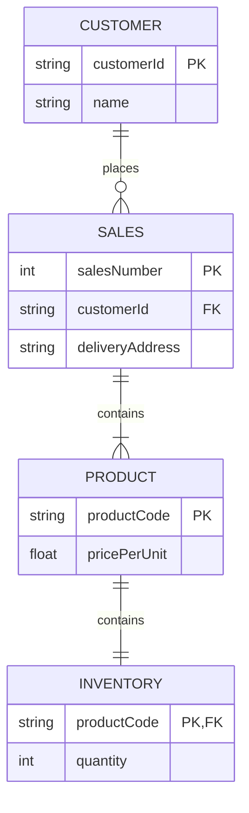

**Description:**
- There is a CUSTOMER entity which has the customerId and description. It has a zero to many relationship with the SALES entity. 
- The SALES entity has a one to many relationship with the PRODUCT entity as one or more product can be a part of a sales transaction. 
- The PRODUCT entity has a one to one relationship with the INVENTORY entity.
- Every sale transaction will have a customer, hence the customerId is a forgein key in SALES entity. 
- The customerId is the primary key in the customer entity.
- The salesNumber is the primary key of the SALES entity. 
- productCode is a FK in the INVENTORY entity associated with productCode of the PRODUCT entity.
