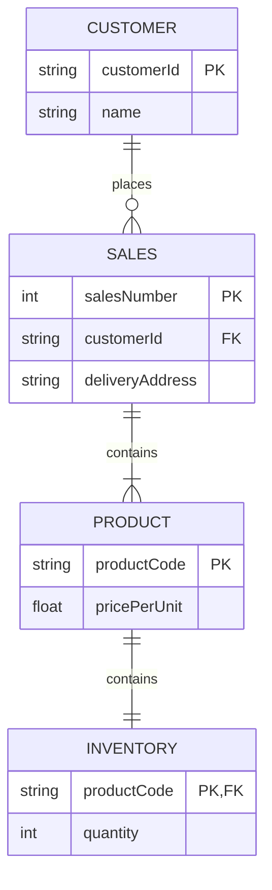

```mermaid
erDiagram
    direction TB
    CUSTOMER ||--o{ SALES : places
    CUSTOMER {
	      string customerId PK
        string name
    }
    SALES ||--|{ PRODUCT : contains
    SALES {
        int salesNumber PK
        string customerId FK
        string deliveryAddress
    }
    PRODUCT ||--|| INVENTORY : contains 
    PRODUCT {
        string productCode PK
        float pricePerUnit
    }
    INVENTORY {
	      string productCode PK,FK
	      int quantity
    }
```
